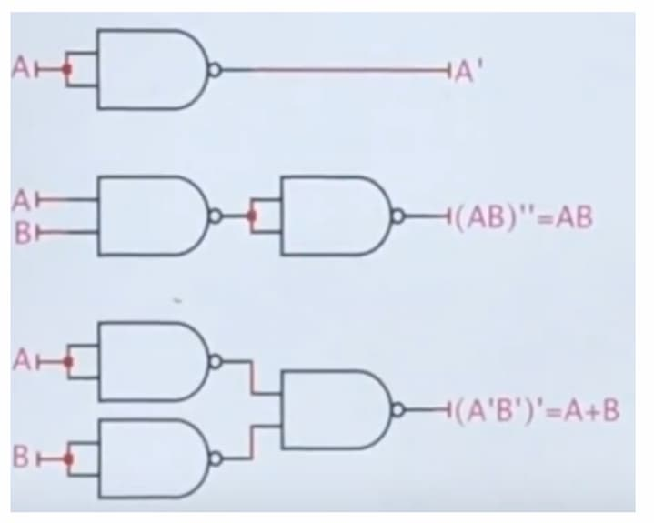
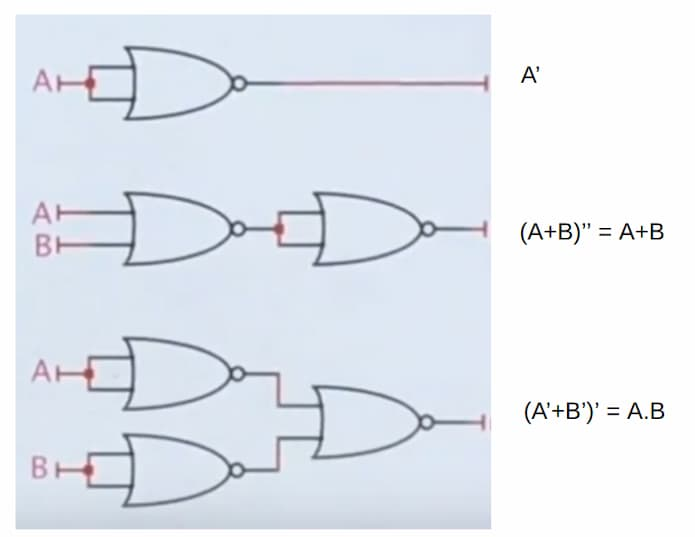

There are AND, OR, XOR, and their inverted versions. Usually takes 2 inputs. Can
be extended for n-inputs.

### XOR

Returns true **iff** when the number of true inputs are odd.

## Universal gate

A gate is a universal gate **iff** a collection of that gates can be arranged to
implement AND, OR & NOT gates. Can be used to implement any circuit. Is
_functionally complete_.

NAND and NOR gates are universal.





## Logical circuit representation

Logical circuits are a abstraction of transistor circuits. The logical circuits
can be built using <abbr title="Transistor-Transistor Logic">TTL</abbr> or
<abbr title="Complementary Metal Oxide Semiconductor">CMOS</abbr>.

### TTL

Two or more (bipolar junction) transistors are used. 0V for LOW. 5V for HIGH.
Power consumption is high (even when idle). Switching is fast. Slow compared to
modern CMOS. Low noise margin compared to CMOS.

### CMOS

Uses 2 metal oxide semiconductors. Power consumption is very low. High speed.
High noise margin.

:::note

It is recommended to design CMOS with NAND gates only. NAND gates have more
fanout and less power comsumption.

:::

### Power consumption

```math
\text{Dynamic power consumption} = CV^2 f
```

Here:

- $C$ - Capacitance of the circuit
- $V$ - Supply voltage
- $f$ - Charging frequency of the capacitor

```math
\text{Static power consumption} = V I_{\text{leakage}}
```

Here:

- $V$ - Supply voltage
- $I_{\text{leakage}}$ - Leakage current

```math
\text{Energy consumption} = \text{Power} \times \text{Time}
```

## Logic circuits

|               | Combinational Logic   | Sequential Logic          |
| ------------- | --------------------- | ------------------------- |
| Memory        | No                    | Yes                       |
| Feedback loop | No                    | Yes                       |
| Output        | Depends only on input | Depends on input & memory |
