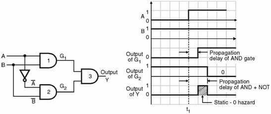
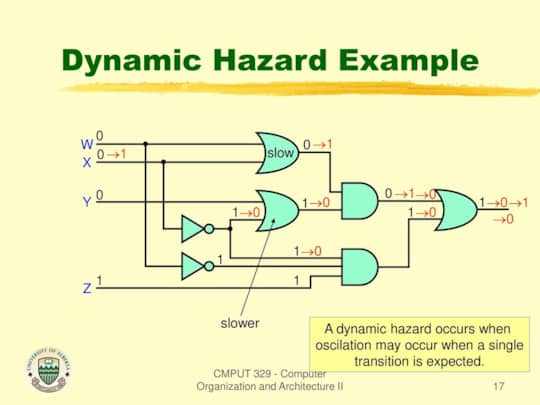

Aka. Glitch. Momentary unwanted switching transient at a logic function's
output. Happens because of unequal propogation delays along different paths in a
combinational circuit.

## Static hazards

Occurs when the output must remain unchanged but switches back and forth due to
a change in input.

When a circuit is implemented as 2-level SOP or POS, the hazard can be detected
using a K-map. There will be a glitch if any two adjacent minterms or maxterms
are not covered by a single product or sum term. Glitches can be resolved by
using redundunt gates.

### Static-0 hazard

Occurs when output must stay at 0 but temporarily switches to a 1 due to a
change in input. Would exist only if a variable and its component are connected
to the same AND gate, either directly or via other gates.

<figure style="max-width: 700px; margin: 10px auto;">

<figcaption>

Image by
[Electronics Tutorial website](https://www.electronics-tutorial.net/finite-state-machines/Hazards/Static-Hazards/)

</figcaption>
</figure>

### Static-1 hazard

Occurs when output must stay at 1 but temporarily switches to a 0 due to a
change in input.

In the example below, The 2
rectangles are enough to include all the HIGH outputs.
Third one is added to avoid
the static-1 hazard.

<svg version="1.1" xmlns="http://www.w3.org/2000/svg" viewBox="0 0 381 381" class="mx-auto" width="381" height="381"><!-- svg-source:excalidraw --><metadata></metadata><defs></defs>
<g stroke-linecap="round" transform="translate(97 96) rotate(0 135 136)">
<path d="M0 0 C54.46 -0.72, 107.97 -0.75, 270 0 M0 0 C56.76 -1.54, 114 -1.42, 270 0 M270 0 C270.68 77.48, 271.32 154.66, 270 272 M270 0 C272.3 81.89, 271.33 162.51, 270 272 M270 272 C198.85 271.44, 124.78 271.39, 0 272 M270 272 C167.31 273.78, 64.25 273.3, 0 272 M0 272 C0.71 175.44, 0.87 81.6, 0 0 M0 272 C-0.3 204.64, -0.44 138.03, 0 0" stroke="currentColor" stroke-width="4" fill="none"></path>
</g>
<g stroke-linecap="round"><g transform="translate(36 31) rotate(0 31.5 31.5)"><path d="M0 0 C22.42 25.44, 47.72 49.16, 63 63 M0 0 C15.32 15.85, 32.73 33.23, 63 63" stroke="currentColor" stroke-width="4" fill="none"></path></g></g><mask></mask><g stroke-linecap="round"><g transform="translate(167 93) rotate(0 0 138.5)"><path d="M0 0 C2.93 60.23, 0.57 119.1, 0 277 M0 0 C1.71 74.23, 1.66 149.46, 0 277" stroke="currentColor" stroke-width="4" fill="none"></path></g></g><mask></mask><g stroke-linecap="round"><g transform="translate(232 93) rotate(0 0 138.5)"><path d="M0 0 C1.55 98.15, 1.64 199.67, 0 277 M0 0 C0 62.36, -0.56 126.32, 0 277" stroke="currentColor" stroke-width="4" fill="none"></path></g></g><mask></mask><g stroke-linecap="round"><g transform="translate(302 94) rotate(0 0 138.5)"><path d="M0 0 C-0.18 89.65, 0.12 179.52, 0 277 M0 0 C0.9 110.16, 0.22 218.23, 0 277" stroke="currentColor" stroke-width="4" fill="none"></path></g></g><mask></mask><g stroke-linecap="round"><g transform="translate(369 161) rotate(0 -134.5 1.5)"><path d="M0 0 C-107.54 4.47, -213.93 3.98, -269 3 M0 0 C-99.1 -0.12, -197.94 0.66, -269 3" stroke="currentColor" stroke-width="4" fill="none"></path></g></g><mask></mask><g stroke-linecap="round"><g transform="translate(371 229) rotate(0 -134.5 1.5)"><path d="M0 0 C-79.4 3.86, -161.54 2.99, -269 3 M0 0 C-66.89 -1.49, -133.35 0.03, -269 3" stroke="currentColor" stroke-width="4" fill="none"></path></g></g><mask></mask><g stroke-linecap="round"><g transform="translate(366 294) rotate(0 -134.5 1.5)"><path d="M0 0 C-69.34 1.3, -136.79 0.03, -269 3 M0 0 C-83.84 0.55, -167.49 2.21, -269 3" stroke="currentColor" stroke-width="4" fill="none"></path></g></g><mask></mask><g transform="translate(54 10) rotate(0 20.118087768554688 17.5)"><text x="0" y="24.668" font-family="Excalifont, Xiaolai, Segoe UI Emoji" font-size="28px" fill="currentColor" text-anchor="start" style="white-space: pre;" direction="ltr" dominant-baseline="alphabetic">AB</text></g><g transform="translate(113 56) rotate(0 18.592071533203125 17.5)"><text x="0" y="24.668" font-family="Excalifont, Xiaolai, Segoe UI Emoji" font-size="28px" fill="currentColor" text-anchor="start" style="white-space: pre;" direction="ltr" dominant-baseline="alphabetic">00</text></g><g transform="translate(48.68199157714844 112) rotate(0 18.592071533203125 17.5)"><text x="0" y="24.668" font-family="Excalifont, Xiaolai, Segoe UI Emoji" font-size="28px" fill="currentColor" text-anchor="start" style="white-space: pre;" direction="ltr" dominant-baseline="alphabetic">00</text></g><g transform="translate(185 56) rotate(0 15.274063110351562 17.5)"><text x="0" y="24.668" font-family="Excalifont, Xiaolai, Segoe UI Emoji" font-size="28px" fill="currentColor" text-anchor="start" style="white-space: pre;" direction="ltr" dominant-baseline="alphabetic">01</text></g><g transform="translate(52 180) rotate(0 15.274063110351562 17.5)"><text x="0" y="24.668" font-family="Excalifont, Xiaolai, Segoe UI Emoji" font-size="28px" fill="currentColor" text-anchor="start" style="white-space: pre;" direction="ltr" dominant-baseline="alphabetic">01</text></g><g transform="translate(255 56) rotate(0 11.9560546875 17.5)"><text x="0" y="24.668" font-family="Excalifont, Xiaolai, Segoe UI Emoji" font-size="28px" fill="currentColor" text-anchor="start" style="white-space: pre;" direction="ltr" dominant-baseline="alphabetic">11</text></g><g transform="translate(55.31800842285156 249) rotate(0 11.9560546875 17.5)"><text x="0" y="24.668" font-family="Excalifont, Xiaolai, Segoe UI Emoji" font-size="28px" fill="currentColor" text-anchor="start" style="white-space: pre;" direction="ltr" dominant-baseline="alphabetic">11</text></g><g transform="translate(325 56) rotate(0 15.274063110351562 17.5)"><text x="0" y="24.668" font-family="Excalifont, Xiaolai, Segoe UI Emoji" font-size="28px" fill="currentColor" text-anchor="start" style="white-space: pre;" direction="ltr" dominant-baseline="alphabetic">10</text></g><g transform="translate(52 317) rotate(0 15.274063110351562 17.5)"><text x="0" y="24.668" font-family="Excalifont, Xiaolai, Segoe UI Emoji" font-size="28px" fill="currentColor" text-anchor="start" style="white-space: pre;" direction="ltr" dominant-baseline="alphabetic">10</text></g><g transform="translate(195 179.5) rotate(0 5.97802734375 17.5)"><text x="0" y="24.668" font-family="Excalifont, Xiaolai, Segoe UI Emoji" font-size="28px" fill="currentColor" text-anchor="start" style="white-space: pre;" direction="ltr" dominant-baseline="alphabetic">1</text></g><g transform="translate(194 246.5) rotate(0 5.97802734375 17.5)"><text x="0" y="24.668" font-family="Excalifont, Xiaolai, Segoe UI Emoji" font-size="28px" fill="currentColor" text-anchor="start" style="white-space: pre;" direction="ltr" dominant-baseline="alphabetic">1</text></g><g transform="translate(262 246.5) rotate(0 5.97802734375 17.5)"><text x="0" y="24.668" font-family="Excalifont, Xiaolai, Segoe UI Emoji" font-size="28px" fill="currentColor" text-anchor="start" style="white-space: pre;" direction="ltr" dominant-baseline="alphabetic">1</text></g><g transform="translate(258 179.5) rotate(0 5.97802734375 17.5)"><text x="0" y="24.668" font-family="Excalifont, Xiaolai, Segoe UI Emoji" font-size="28px" fill="currentColor" text-anchor="start" style="white-space: pre;" direction="ltr" dominant-baseline="alphabetic">1</text></g><g transform="translate(327.5 179.5) rotate(0 5.97802734375 17.5)"><text x="0" y="24.668" font-family="Excalifont, Xiaolai, Segoe UI Emoji" font-size="28px" fill="currentColor" text-anchor="start" style="white-space: pre;" direction="ltr" dominant-baseline="alphabetic">1</text></g><g transform="translate(327.5 112) rotate(0 5.97802734375 17.5)"><text x="0" y="24.668" font-family="Excalifont, Xiaolai, Segoe UI Emoji" font-size="28px" fill="currentColor" text-anchor="start" style="white-space: pre;" direction="ltr" dominant-baseline="alphabetic">1</text></g><g transform="translate(10 52) rotate(0 19.72608184814453 17.5)"><text x="0" y="24.668" font-family="Excalifont, Xiaolai, Segoe UI Emoji" font-size="28px" fill="currentColor" text-anchor="start" style="white-space: pre;" direction="ltr" dominant-baseline="alphabetic">CD</text></g><g stroke-linecap="round" transform="translate(172 171) rotate(0 59.5 57.5)"><path d="M28.75 0 C40.88 0.18, 57.29 1.06, 90.25 0 M28.75 0 C44.61 0.13, 61.08 0.83, 90.25 0 M90.25 0 C109.16 -0.55, 119.64 9.14, 119 28.75 M90.25 0 C109.41 0.7, 118.47 8.07, 119 28.75 M119 28.75 C120 47.55, 117.82 69.36, 119 86.25 M119 28.75 C120.12 40.41, 119.73 53.07, 119 86.25 M119 86.25 C119.52 105.6, 109.96 113.08, 90.25 115 M119 86.25 C117.24 106.85, 109.87 115.6, 90.25 115 M90.25 115 C69.68 116.17, 49.37 113.97, 28.75 115 M90.25 115 C74.14 114.08, 59.52 115.2, 28.75 115 M28.75 115 C11.18 116.97, -1.59 106.83, 0 86.25 M28.75 115 C8.45 113.13, -0.97 106.79, 0 86.25 M0 86.25 C-0.85 74.59, -1.42 59.89, 0 28.75 M0 86.25 C0.26 63.38, -0.85 40.89, 0 28.75 M0 28.75 C-1.19 8.85, 11.46 -1.66, 28.75 0 M0 28.75 C-1.32 11.12, 10 0.97, 28.75 0" stroke="#1971c2" stroke-width="4" fill="none"></path></g><g stroke-linecap="round" transform="translate(313 105) rotate(0 20.5 57.5)"><path d="M10.25 0 C17.97 -1.75, 22.17 -0.79, 30.75 0 M10.25 0 C14.58 0.71, 20.82 0.89, 30.75 0 M30.75 0 C39.55 -1.59, 42.41 2.43, 41 10.25 M30.75 0 C35.72 -0.97, 42.38 1.4, 41 10.25 M41 10.25 C40.85 36.86, 38.35 68.3, 41 104.75 M41 10.25 C41.85 45.35, 42.24 80.68, 41 104.75 M41 104.75 C40.27 113.46, 35.92 113.85, 30.75 115 M41 104.75 C42.53 112, 38.56 115.51, 30.75 115 M30.75 115 C26.09 113.24, 19.2 115.37, 10.25 115 M30.75 115 C25.03 114.92, 18.91 114.3, 10.25 115 M10.25 115 C3.08 115.13, -0.52 111.57, 0 104.75 M10.25 115 C1.18 115.68, -1.19 111.41, 0 104.75 M0 104.75 C2.12 77.66, 1.04 47, 0 10.25 M0 104.75 C-0.41 68.7, -1.03 30.9, 0 10.25 M0 10.25 C0.08 3.03, 4.99 0.93, 10.25 0 M0 10.25 C-0.77 3.61, 1.86 0.41, 10.25 0" stroke="#1971c2" stroke-width="4" fill="none"></path></g><g stroke-linecap="round" transform="translate(248 172) rotate(0 55.5 23.5)"><path d="M11.75 0 C43.09 -1.42, 76.64 -1.49, 99.25 0 M11.75 0 C43.08 -0.46, 75.2 -0.34, 99.25 0 M99.25 0 C105.81 -1.57, 112.81 5.44, 111 11.75 M99.25 0 C109.04 1.88, 110.38 5, 111 11.75 M111 11.75 C109.52 17.36, 110.7 24.64, 111 35.25 M111 11.75 C109.95 18.33, 109.9 27.5, 111 35.25 M111 35.25 C112.62 42.44, 108.14 46.03, 99.25 47 M111 35.25 C109.4 43.43, 105.47 48.14, 99.25 47 M99.25 47 C71.09 47.68, 46.1 47.14, 11.75 47 M99.25 47 C72.76 46.82, 47.33 46.42, 11.75 47 M11.75 47 C2.32 46.93, 0.27 44.3, 0 35.25 M11.75 47 C2.77 45.74, 1.02 42.73, 0 35.25 M0 35.25 C-0.39 30.13, 0.08 20.91, 0 11.75 M0 35.25 C-0.32 28.15, 0.5 18.49, 0 11.75 M0 11.75 C-0.37 3.36, 4.76 0.45, 11.75 0 M0 11.75 C1.52 4.64, 4.02 0.91, 11.75 0" stroke="#e03131" stroke-width="4" fill="none"></path></g></svg>

## Dynamic hazards

Occurs when input changes, and output must change but temporarily flips between
values. An unwanted change in output. Won't occur in 2 level circuits.
Identification and elimation is hard.

If there are 3 or more paths from an input or its complement to the output, the
circuit has the potential for a dynamic hazard.

<figure style="max-width: 700px; margin: 10px auto;">

<figcaption>

A slide by [Jose Nelson Amaral](https://slideplayer.com/slide/13254593/)

</figcaption>
</figure>

## Elimination

For synchronous circuits: the clock signal can be tuned to eliminate hazards.

For asynchronous circuits: must use the methods mentioned above.
