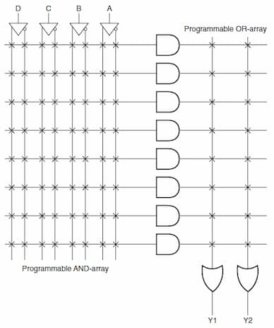
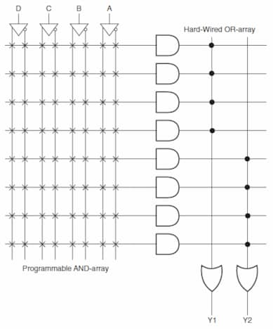

A Programmable Logic Device is an electronic component used to build digital
circuits that can be programmed by the user to perform a variety of logical
operations.

## Programmable Logic Array

A PLD with programmable AND gate array followed by programmable OR gate array.
High flexibility. Slower. Expensive.

<figure style="max-width: 700px; margin: 10px auto;">

<figcaption>

Image from
[Electronics Tutorial website](https://www.electronics-tutorial.net/programmable-logic-devices/programmable-logic-array/).

</figcaption>
</figure>

### Input Buffer

Takes in 1 input ($A$) and produces 2 outputs ($A$ and $\overline{A}$).

### Steps

- Write down the truth table
- Reduce minimal SOP form for outputs
- Find total number of input buffers (which is equal to number of inputs)
- Find total number of programmable AND gates (= no of minterms)
- Find total number of programmable OR gates (= no of functions)

## Programmable Array Logic

Most commonly used type of PLD. Has programmable AND gate array and fixed OR
gate array. Moderate flexibility. Cheaper. Faster.

<figure style="max-width: 700px; margin: 10px auto;">

<figcaption>

Image from
[Electronics Tutorial website](https://www.electronics-tutorial.net/programmable-logic-devices/programmable-array-logic/).

</figcaption>
</figure>
