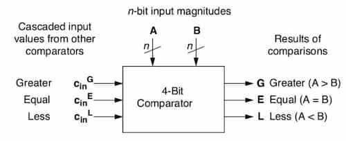

A digital logic component that compares two binary numbers.



## Equality Comparator

Outputs whether the two numbers are equal or not.

## Magnitude Comparator

Outputs whether the two numbers are equal or less than or greater than.

### 1-bit Magnitude Comparator

Suppose the comparator takes in $A$ and $B$. And the output $G$ denotes whether
$A$ is greater than $B$.

$ G = A\overline{B} $

$ E = AB + \overline{A}\cdot\overline{B} $

$ L = \overline{A} B $

### n-bit Magnitude Comparator

Let
$x_i = A_i B_i + \overline{A_i}\cdot \overline{B_i} = \overline{A_i \oplus B_i}$.
$x_i$ denotes if $A_i = B_i$.

```math
G = \sum_{i=0}^{n-1} \Bigg(\bigg(\prod_{j=i+1}^{n-1}{x_j}\bigg)  A_i\overline{B_i}\Bigg)
```

```math
E = \prod_{i=0}^{n-1} {x_i}
```

```math
L = \sum_{i=0}^{n-1} \Bigg(\bigg(\prod_{j=i+1}^{n-1}{x_j}\bigg)  \overline{A_i}B_i\Bigg)
```
