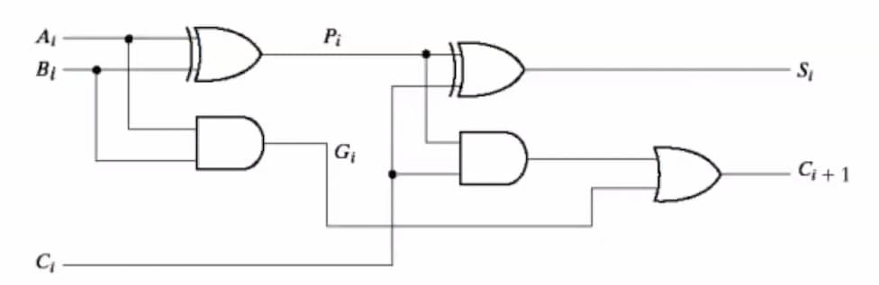

## Half Adder

A digital circuit component that adds 2 bits. Outputs 2 bits: sum bit and carry
bit.

```math
S = A \oplus B
\;\;
\text{ and }
\;\;
C = A \cdot B
```

## Full Adder

A digital circuit component that adds 3 bits. Outputs 2 bits: sum bit and carry
bit. An extension of the half adder where the carry bit of a half adder is input
to another half adder. Built using 2 half adders.

```math
S =
\overline{A}\cdot \overline{B} C_\text{in} +
\overline{A} {B} \overline{C_\text{in}} +
{A} \overline{B}\cdot \overline{C_\text{in}} +
{A} B C_\text{in}
```

```math
C_\text{out} = \overline{A} B C_\text{in} + A B + A\overline{B}C_\text{in}
```

<svg direction="ltr" width="1285.1000061035156" height="544" viewBox="266.1000061035156 159 1285.1000061035156 544"
	stroke-linecap="round" stroke-linejoin="round" stroke="currentColor">
<g transform="matrix(1, 0, 0, 1, 533, 364)" opacity="1"> <path
			d="M7,-0.0109 L230.5423,-0.3605 Q237.5423,-0.3714 237.5657,6.6286 L238.5436,299.302 Q238.567,306.302 231.567,306.318 L7.5364,306.8297 Q0.5364,306.8457 0.5503,299.8457 L1.1324,6.0784 Q1.1462,-0.9216 8.1462,-0.888 L232.0431,0.1847 Q239.0431,0.2182 239.0444,7.2182 L239.099,299.9758 Q239.1003,306.9758 232.1004,306.9469 L7.1228,306.0179 Q0.1229,305.989 0.1293,298.989 L0.3977,7.1995 Q0.4041,0.1995 7,-0.0109 "
			stroke-width="3.5" fill="none" /> </g>
<g transform="matrix(1, 0, 0, 1, 878, 191)" opacity="1"> <path
			d="M7,0.0038 L232.1278,0.1271 Q239.1278,0.131 239.0954,7.1309 L237.7372,301.083 Q237.7048,308.0829 230.7048,308.0626 L6.5647,307.4109 Q-0.4353,307.3906 -0.4189,300.3906 L0.2666,7.2044 Q0.283,0.2044 7.283,0.1839 L231.4508,-0.4743 Q238.4507,-0.4949 238.424,6.505 L237.3059,299.4979 Q237.2792,306.4978 230.2793,306.5267 L7.9454,307.4429 Q0.9454,307.4718 0.9158,300.4718 L-0.3239,7.7461 Q-0.3535,0.7461 7,0.0038 "
			stroke-width="3.5" fill="none" /> </g>
<g transform="matrix(1, 0, 0, 1, 594, 471.7)" opacity="1"><text font-size="36" font-style="normal"
			font-weight="normal" dominant-baseline="mathematical" alignment-baseline="mathematical"
			stroke="rgb(249, 250, 251)" stroke-width="2" fill="rgb(249, 250, 251)">
<tspan alignment-baseline="mathematical" x="22.649993896484375" y="18.00000762939453" unicode-bidi="plaintext">
Half</tspan>
<tspan alignment-baseline="mathematical" x="100.33332824707031" y="18.00000762939453" unicode-bidi="plaintext"> 
</tspan> <tspan alignment-baseline="mathematical" x="0" y="66.5999984741211">
</tspan>
<tspan alignment-baseline="mathematical" x="3.98333740234375" y="66.5999984741211" unicode-bidi="plaintext">Adder
</tspan>
</text><text font-size="36" font-style="normal" font-weight="normal" dominant-baseline="mathematical"
			alignment-baseline="mathematical" fill="currentColor">
<tspan alignment-baseline="mathematical" x="22.649993896484375" y="18.00000762939453" unicode-bidi="plaintext">
Half</tspan>
<tspan alignment-baseline="mathematical" x="100.33332824707031" y="18.00000762939453" unicode-bidi="plaintext"> 
</tspan> <tspan alignment-baseline="mathematical" x="0" y="66.5999984741211">
</tspan>
<tspan alignment-baseline="mathematical" x="3.98333740234375" y="66.5999984741211" unicode-bidi="plaintext">Adder
</tspan> </text></g>
<g transform="matrix(1, 0, 0, 1, 939, 298.7)" opacity="1"><text font-size="36" font-style="normal"
			font-weight="normal" dominant-baseline="mathematical" alignment-baseline="mathematical"
			stroke="rgb(249, 250, 251)" stroke-width="2" fill="rgb(249, 250, 251)">
<tspan alignment-baseline="mathematical" x="22.649993896484375" y="18.00000762939453" unicode-bidi="plaintext">
Half</tspan>
<tspan alignment-baseline="mathematical" x="100.33332824707031" y="18.00000762939453" unicode-bidi="plaintext"> 
</tspan> <tspan alignment-baseline="mathematical" x="0" y="66.5999984741211">
</tspan>
<tspan alignment-baseline="mathematical" x="3.98333740234375" y="66.5999984741211" unicode-bidi="plaintext">Adder
</tspan>
</text><text font-size="36" font-style="normal" font-weight="normal" dominant-baseline="mathematical"
			alignment-baseline="mathematical" fill="currentColor">
<tspan alignment-baseline="mathematical" x="22.649993896484375" y="18.00000762939453" unicode-bidi="plaintext">
Half</tspan>
<tspan alignment-baseline="mathematical" x="100.33332824707031" y="18.00000762939453" unicode-bidi="plaintext"> 
</tspan> <tspan alignment-baseline="mathematical" x="0" y="66.5999984741211">
</tspan>
<tspan alignment-baseline="mathematical" x="3.98333740234375" y="66.5999984741211" unicode-bidi="plaintext">Adder
</tspan> </text></g>
<g transform="matrix(1, 0, 0, 1, 541.05, 413.7)" opacity="1"><text font-size="24" font-style="normal"
			font-weight="normal" dominant-baseline="mathematical" alignment-baseline="mathematical"
			stroke="rgb(249, 250, 251)" stroke-width="2" fill="rgb(249, 250, 251)">
<tspan alignment-baseline="mathematical" x="5.9333343505859375" y="12.699996948242188" unicode-bidi="plaintext">A
</tspan>
</text><text font-size="24" font-style="normal" font-weight="normal" dominant-baseline="mathematical"
			alignment-baseline="mathematical" fill="currentColor">
<tspan alignment-baseline="mathematical" x="5.9333343505859375" y="12.699996948242188" unicode-bidi="plaintext">A
</tspan> </text></g>
<g transform="matrix(1, 0, 0, 1, 298.1, 233.7)" opacity="1"><text font-size="24" font-style="normal"
			font-weight="normal" dominant-baseline="mathematical" alignment-baseline="mathematical"
			stroke="rgb(249, 250, 251)" stroke-width="2" fill="rgb(249, 250, 251)">
<tspan alignment-baseline="mathematical" x="2.51666259765625" y="12.699996948242188" unicode-bidi="plaintext">C_in
</tspan>
</text><text font-size="24" font-style="normal" font-weight="normal" dominant-baseline="mathematical"
			alignment-baseline="mathematical" fill="currentColor">
<tspan alignment-baseline="mathematical" x="2.51666259765625" y="12.699996948242188" unicode-bidi="plaintext">C_in
</tspan> </text></g>
<g transform="matrix(1, 0, 0, 1, 1438.15, 551.7)" opacity="1"><text font-size="24" font-style="normal"
			font-weight="normal" dominant-baseline="mathematical" alignment-baseline="mathematical"
			stroke="rgb(249, 250, 251)" stroke-width="2" fill="rgb(249, 250, 251)">
<tspan alignment-baseline="mathematical" x="4.25" y="12.699996948242188" unicode-bidi="plaintext">C_out</tspan>
</text>
<text font-size="24" font-style="normal" font-weight="normal" dominant-baseline="mathematical"
			alignment-baseline="mathematical" fill="currentColor">
<tspan alignment-baseline="mathematical" x="4.25" y="12.699996948242188" unicode-bidi="plaintext">C_out</tspan>
</text> </g> <g transform="matrix(1, 0, 0, 1, 1404.2, 239.7)" opacity="1">
<text font-size="24" font-style="normal" font-weight="normal" dominant-baseline="mathematical"
			alignment-baseline="mathematical" stroke="rgb(249, 250, 251)" stroke-width="2" fill="rgb(249, 250, 251)">
<tspan alignment-baseline="mathematical" x="19.75" y="12.699996948242188" unicode-bidi="plaintext">S</tspan>
</text><text font-size="24" font-style="normal" font-weight="normal" dominant-baseline="mathematical"
			alignment-baseline="mathematical" fill="currentColor">
<tspan alignment-baseline="mathematical" x="19.75" y="12.699996948242188" unicode-bidi="plaintext">S</tspan>
</text> </g> <g transform="matrix(1, 0, 0, 1, 304.15, 412.7)" opacity="1">
<text font-size="24" font-style="normal" font-weight="normal" dominant-baseline="mathematical"
			alignment-baseline="mathematical" stroke="currentColor" stroke-width="2" fill="rgb(249, 250, 251)">
<tspan alignment-baseline="mathematical" x="20.433334350585938" y="12.699996948242188" unicode-bidi="plaintext">A
</tspan>
</text><text font-size="24" font-style="normal" font-weight="normal" dominant-baseline="mathematical"
			alignment-baseline="mathematical" fill="currentColor">
<tspan alignment-baseline="mathematical" x="20.433334350585938" y="12.699996948242188" unicode-bidi="plaintext">A
</tspan> </text> </g>
<g transform="matrix(1, 0, 0, 1, 310.2, 589.7)" opacity="1"><text font-size="24" font-style="normal"
			font-weight="normal" dominant-baseline="mathematical" alignment-baseline="mathematical"
			stroke="rgb(249, 250, 251)" stroke-width="2" fill="rgb(249, 250, 251)">
<tspan alignment-baseline="mathematical" x="22.066665649414062" y="12.699996948242188" unicode-bidi="plaintext">B
</tspan>
</text><text font-size="24" font-style="normal" font-weight="normal" dominant-baseline="mathematical"
			alignment-baseline="mathematical" fill="currentColor">
<tspan alignment-baseline="mathematical" x="22.066665649414062" y="12.699996948242188" unicode-bidi="plaintext">B
</tspan> </text></g>
<g transform="matrix(1, 0, 0, 1, 886.05, 240.7)" opacity="1"><text font-size="24" font-style="normal"
			font-weight="normal" dominant-baseline="mathematical" alignment-baseline="mathematical"
			stroke="rgb(249, 250, 251)" stroke-width="2" fill="rgb(249, 250, 251)">
<tspan alignment-baseline="mathematical" x="5.9333343505859375" y="12.699996948242188" unicode-bidi="plaintext">A
</tspan>
</text><text font-size="24" font-style="normal" font-weight="normal" dominant-baseline="mathematical"
			alignment-baseline="mathematical" fill="currentColor">
<tspan alignment-baseline="mathematical" x="5.9333343505859375" y="12.699996948242188" unicode-bidi="plaintext">A
</tspan> </text></g>
<g transform="matrix(1, 0, 0, 1, 737.05, 412.7)" opacity="1"><text font-size="24" font-style="normal"
			font-weight="normal" dominant-baseline="mathematical" alignment-baseline="mathematical"
			stroke="rgb(249, 250, 251)" stroke-width="2" fill="rgb(249, 250, 251)">
<tspan alignment-baseline="mathematical" x="8.25" y="12.699996948242188" unicode-bidi="plaintext">S</tspan>
</text><text font-size="24" font-style="normal" font-weight="normal" dominant-baseline="mathematical"
			alignment-baseline="mathematical" fill="currentColor">
<tspan alignment-baseline="mathematical" x="8.25" y="12.699996948242188" unicode-bidi="plaintext">S</tspan>
</text></g>
<g transform="matrix(1, 0, 0, 1, 1082.05, 239.7)" opacity="1"><text font-size="24" font-style="normal"
			font-weight="normal" dominant-baseline="mathematical" alignment-baseline="mathematical"
			stroke="rgb(249, 250, 251)" stroke-width="2" fill="rgb(249, 250, 251)">
<tspan alignment-baseline="mathematical" x="8.25" y="12.699996948242188" unicode-bidi="plaintext">S</tspan>
</text><text font-size="24" font-style="normal" font-weight="normal" dominant-baseline="mathematical"
			alignment-baseline="mathematical" fill="currentColor">
<tspan alignment-baseline="mathematical" x="8.25" y="12.699996948242188" unicode-bidi="plaintext">S</tspan>
</text></g>
<g transform="matrix(1, 0, 0, 1, 538.1, 589.7)" opacity="1"><text font-size="24" font-style="normal"
			font-weight="normal" dominant-baseline="mathematical" alignment-baseline="mathematical"
			stroke="rgb(249, 250, 251)" stroke-width="2" fill="rgb(249, 250, 251)">
<tspan alignment-baseline="mathematical" x="7.5666656494140625" y="12.699996948242188" unicode-bidi="plaintext">B
</tspan>
</text><text font-size="24" font-style="normal" font-weight="normal" dominant-baseline="mathematical"
			alignment-baseline="mathematical" fill="currentColor">
<tspan alignment-baseline="mathematical" x="7.5666656494140625" y="12.699996948242188" unicode-bidi="plaintext">B
</tspan> </text></g>
<g transform="matrix(1, 0, 0, 1, 883.1, 416.7)" opacity="1"><text font-size="24" font-style="normal"
			font-weight="normal" dominant-baseline="mathematical" alignment-baseline="mathematical"
			stroke="rgb(249, 250, 251)" stroke-width="2" fill="rgb(249, 250, 251)">
<tspan alignment-baseline="mathematical" x="7.5666656494140625" y="12.699996948242188" unicode-bidi="plaintext">B
</tspan>
</text><text font-size="24" font-style="normal" font-weight="normal" dominant-baseline="mathematical"
			alignment-baseline="mathematical" fill="currentColor">
<tspan alignment-baseline="mathematical" x="7.5666656494140625" y="12.699996948242188" unicode-bidi="plaintext">B
</tspan> </text></g>
<g transform="matrix(1, 0, 0, 1, 734.1, 588.7)" opacity="1"><text font-size="24" font-style="normal"
			font-weight="normal" dominant-baseline="mathematical" alignment-baseline="mathematical"
			stroke="rgb(249, 250, 251)" stroke-width="2" fill="rgb(249, 250, 251)">
<tspan alignment-baseline="mathematical" x="7.633331298828125" y="12.699996948242188" unicode-bidi="plaintext">C
</tspan>
</text><text font-size="24" font-style="normal" font-weight="normal" dominant-baseline="mathematical"
			alignment-baseline="mathematical" fill="currentColor">
<tspan alignment-baseline="mathematical" x="7.633331298828125" y="12.699996948242188" unicode-bidi="plaintext">C
</tspan> </text></g>
<g transform="matrix(1, 0, 0, 1, 1079.1, 415.7)" opacity="1"><text font-size="24" font-style="normal"
			font-weight="normal" dominant-baseline="mathematical" alignment-baseline="mathematical"
			stroke="rgb(249, 250, 251)" stroke-width="2" fill="rgb(249, 250, 251)">
<tspan alignment-baseline="mathematical" x="7.633331298828125" y="12.699996948242188" unicode-bidi="plaintext">C
</tspan> </text>
<text font-size="24" font-style="normal" font-weight="normal" dominant-baseline="mathematical"
			alignment-baseline="mathematical" fill="currentColor">
<tspan alignment-baseline="mathematical" x="7.633331298828125" y="12.699996948242188" unicode-bidi="plaintext">C
</tspan> </text> </g>
<g transform="matrix(1, 0, 0, 1, 726.7155, 430)" opacity="1">
<path d="M 43.2691,0 L50.2691,0 L 147.8507,0 M 43.2691,0 L50.269,0.0482 L 148.3313,0.7237 " stroke="currentColor"
			stroke-width="3.5" fill="none" transform="scale(1)" />
</g> <g transform="matrix(1, 0, 0, 1, 424.8485, 433)" opacity="1">
<path d="M 5.3767,0 L12.3767,0 L 105.8702,0 M 5.3767,0 L12.3763,-0.0771 L 106.9677,-1.1185 " stroke="currentColor"
			stroke-width="3.5" fill="none" transform="scale(1)" />
</g> <g transform="matrix(1, 0, 0, 1, 426.0659, 606)" opacity="1">
<path d="M 5.3767,0 L12.3767,0 L 104.8702,0 M 5.3767,0 L12.3767,0.0018 L 104.4306,0.0257 " stroke="currentColor"
			stroke-width="3.5" fill="none" transform="scale(1)" />
</g> <g transform="matrix(1, 0, 0, 1, 424.3537, 254)" opacity="1">
<path d="M 4.7218,0 L11.7218,0 L 451.7103,0 M 4.7218,0 L11.7218,0.0176 L 450.9156,1.1243 " stroke="currentColor"
			stroke-width="3.5" fill="none" transform="scale(1)" />
</g> <g transform="matrix(1, 0, 0, 1, 704.0641, 605)" opacity="1">
<path d="M 67,0 L74,0 L 586.0022,0 M 67,0 L74,0.0153 L 586.6993,1.1376 " stroke="currentColor" stroke-width="3.5"
			fill="none" transform="scale(1)" />
</g> <g transform="matrix(1, 0, 0, 1, 1111.0641, 433)" opacity="1">
<path d="M 6,0 L13,0 L 130.6813,0 M 6,0 L12.9999,-0.0364 L 131.8435,-0.6547 " stroke="currentColor"
			stroke-width="3.5" fill="none" transform="scale(1)" />
</g> <g transform="matrix(1, 0, 0, 1, 1237.7454, 527)" opacity="1">
<path d="M 6,0 L13,0 L 54.7224,0 M 6,0 L12.9999,0.035 L 55.1044,0.2459 " stroke="currentColor" stroke-width="3.5"
			fill="none" transform="scale(1)" />
</g> <g transform="matrix(1, 0, 0, 1, 1115.5625, 257)" opacity="1">
<path d="M 0,0 L7,0 L 297.0298,0 M 0,0 L7,0.0143 L 297.3659,0.6058 " stroke="currentColor" stroke-width="3.5"
			fill="none" transform="scale(1)" />
</g> <g transform="matrix(1, 0, 0, 1, 1353.5856, 568)" opacity="1">
<path d="M 0,0 L7,0 L 77.0231,0 M 0,0 L6.9999,0.0417 L 75.9763,0.453 " stroke="currentColor" stroke-width="3.5"
			fill="none" transform="scale(1)" />
</g> <g transform="matrix(1, 0, 0, 1, 1242.5856, 433)" opacity="1">
<path d="M 0,0 L0,7 L 0,92.2677 M 0,0 L0.023,7 L 0.307,93.4172 " stroke="currentColor" stroke-width="3.5"
			fill="none" transform="scale(1)" />
</g> <g transform="matrix(1, 0, 0, 1, 1283.5625, 475)" opacity="1"> <path
			d="M 0,29.9962 L2.5788,36.5038 L 8.9212,52.509 Q 11.5,59.0166 12.7774,65.8991 L 16.7226,87.1547 Q 18,94.0371 16.493,100.873 L 12.007,121.2218 Q 10.5,128.0576 8.3189,134.7091 L 0,160.0781 M 0,29.9962 L2.634,36.4817 L 8.9292,51.9818 Q 11.5633,58.4673 12.893,65.3399 L 17.2313,87.7628 Q 18.561,94.6353 16.8151,101.4141 L 11.7973,120.8973 Q 10.0515,127.6761 7.8499,134.3209 L -0.663,160.0147 "
			stroke="currentColor" stroke-width="3.5" fill="none" transform="scale(1)" /> </g>
<g transform="matrix(1, 0, 0, 1, 1311.5625, 475)" opacity="1"> <path
			d="M -26,27.9962 L-20.4375,29.2487 L -9.3125,31.7538 Q -3.75,33.0064 0.3125,36.259 L 8.4375,42.7641 Q 12.5,46.0166 17.4375,50.6442 L 27.3125,59.8993 Q 32.25,64.5269 35.0865,70.9265 L 41.1635,84.6376 Q 44,91.0371 41.8125,96.6647 L 37.4375,107.9198 Q 35.25,113.5474 32.0625,118.6749 L 25.6875,128.9301 Q 22.5,134.0576 16.603,137.8293 L 4.147,145.7962 Q -1.75,149.5679 -8.0691,152.5794 L -28,162.0781 M -26,27.9962 L-20.4063,29.3335 L -9.2189,32.0082 Q -3.6252,33.3456 0.6356,36.6955 L 9.1572,43.3955 Q 13.418,46.7455 18.0049,51.3425 L 27.1789,60.5363 Q 31.7658,65.1333 34.469,71.5903 L 40.2991,85.5161 Q 43.0023,91.9731 40.8725,97.1691 L 36.6128,107.561 Q 34.483,112.757 31.7314,117.8128 L 26.2283,127.9244 Q 23.4768,132.9802 17.6225,136.8179 L 3.881,145.8258 Q -1.9733,149.6634 -8.2918,152.6762 L -27.5172,161.8431 "
			stroke="currentColor" stroke-width="3.5" fill="none" transform="scale(1)" /> </g>
</svg>

## Ripple Carry Adder

Made by a chain of full adders joined as mentioned below:

<figure style="max-width: 700px; margin: 10px auto;">
<div style="background-color: #efefef">


</div>
<figcaption>

Image from
[Wikipedia](<https://en.wikipedia.org/wiki/Adder_(electronics)#Ripple-carry_adder>).

</figcaption>
</figure>

Carry output of each FA _ripples_ forward to calculate the output. Delay
increases with number of bits.

## Carry Lookahead Adder

A technique to speedup binary addition by calculating carry bits in parallel. In
a CLA:

- Carry generate - means `C_out` will be created
- Carry propogate - means `C_in` will be sent out as `C_out`



```math
P_i = A_i \oplus B_i
\;\;\;\;
G_i = A_i B_i
```

```math
S_i = P_i \oplus C_i
\;\;\;\;
C_{i+1} = G_i + P_i C_i
```

The CLA can be used to create n-bit adders which only have 3 level delay. Faster than RCA.

3 levels of delay:
  - Generate & propagate signals
  - Carry lookahead (sum-of-products)
