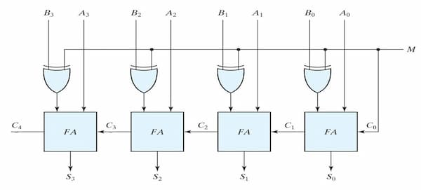

A digital circuit that does the operation $A-B$. The operation can be done by
negating $B$ and then adding it to $A$.

The circuit consists of an inverter and a full adder with `C_0` set to 1.

## Adder-Subtractor

A digital circuit that can do both addition and subtraction. A control signal is
used to switch between the operations.

<!-- No figcaption: source not available anymore -->

In the above example, $M$ is the control. When $M=0$, it works as an adder.
Otherwise it works as a subtractor.
