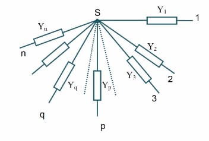
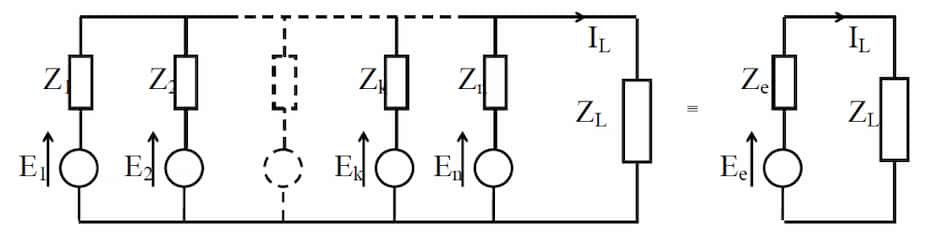
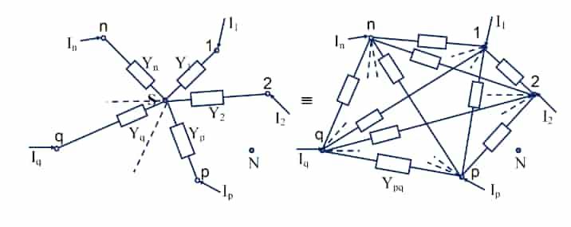

## Definitions

### Linear network

A network is linear **iff** frequency of the output signal is equal to the frequency of the input signal.

## Thevenin's theorem

Any linear electrical network containing only voltage sources, current sources
and resistances can be replaced at terminals A-B by an equivalent combination of
a voltage source $V_{th}$ in a series connection with a resistance $R_{th}$.

- $V_{th}=$ the voltage obtained at terminals A-B of the network with the
  terminals A-B open circuited.
- $R_{th}=$ the resistance that the circuit between A-B terminals would have if
  all the current and voltage sources are set to to provide 0 currents or
  voltages.

:::note

If the terminals are short-cuited, the current flowing from A to B is
$\frac{V_{th}}{R_{th}}$. $ $

:::

## Norton's theorem

In a network made of linear time-invariant resistances, voltage sources and
current sources, at a pair of terminals, it can be replaced by a current source
and a resistor connected in parallel.

In AC circuits, this theorem can be applied to reactive elements as well.

- $I_{no}=$ the current flowing between the terminals as the terminals are short
  circuited
- $R_{no}=\frac{V_{no}}{I_{no}}$ where $V_{no}$ is the voltage between the
  terminals with no load

:::note[Finding the Thevenin Resistance directly]

When there are no dependent sources in a circuit, Thevenin Resistance can be
found directly by setting all the sources to be 0

- A voltage source set to 0 is equivalent to a short circuit.
- A current source set to 0 is equivalent ot a open circuit.

:::

## Superstition theorem

In a linear network with several independent sources, any voltage or current in
the circuit can be found as the algebraic sum of the corresponding values
obtained by assuming only one source at a time, with all the other sources
turned off.

## Reciprocity theorem

In a reciprocal network, if an emf $E$ in one branch produces a current $I$ in
another, then if the emf $E$ is moved to the second branch, it will cause the
same current in the first branch, where the emf has been replaced by a short
circuit.

## Compensation theorem

In a linear, bilateral network, any element can be replaced by a voltage source
of magnitude equal to the current passing through the element multiplied by the
value of the element.

### Bilateral network

A circuit whose characteristics are the same when the direction of current
through various elements. In a linear passive bilateral network, an excitation
and its response can be interchanged.

## Maximum Power Transfer theorem

Aka. Jacobi's law. The theorem states how to choose (so as to maximize power transfer) the load resistance, once the source resistance is given. It _does_ not say how to choose the source resistance for a given load resistance. The source resistance that maximizes power transfer from a voltage source is always $0$ (the hypothetical ideal voltage source). $ $

In a purely resistive network, the load resistance must be equal to the load resistance.

```math
R_L = R_S \quad \text{and}\quad P_\text{max} = \frac{E^2}{4R_L}
```

In an AC network, the load impedance must be equal to the conjugate of the load impedance.

```math
Z_L = \bar{Z_S} \quad \text{and}\quad P_\text{max} = \frac{E^2}{4R_S}
```

And if the load power factor is fixed, the magnitudes of the load impedance and the source impedance must be equal.

```math
|Z_L| = |Z_S| \quad \text{and}\quad P_\text{max} = \frac{E^2}{4R_S}
```

In an AC network, if the load is a resistive load and the source has a complex impedance, the load resistance must be equal to the magnitude value of the source impedance.

```math
R_L = |Z_S| \quad \text{and}\quad P_\text{max} = \frac{E^2 |Z_S|}{2 |Z_S|(R_S+|Z_S|)}
```

## Millmann's theorem



Suppose there are $n$ number of admittances which share a point $S$ and the
other ends are open.

```math
V_{\text{SN}} =
\frac
{\sum_{p=1}^n {Y_\text{P} V_{\text{PN}}}}
{\sum_{p=1}^n {Y_\text{P}}}
```

## Equivalent Generator theorem



An extension of Millmann's theorem. A system of voltage sources operating in
parallel may be replaced by a single voltage source in series with an equivalent
impedance. This is also Thevenin's theorem applied to generators in parallel.

```math
E_\text{eq}=
\frac
{1}
{Y_\text{eq}}

{\sum_{k=1}^n E_k Y_k}
```

```math
Y_\text{eq}=
{\sum_{k=1}^n Y_k}
```

## Rosen's theorem



Used to convert star connected network to mesh equivalent. External conditions
will not be affected.

```math
Y_{\text{pq}} = \frac{Y_p Y_q}{\sum_{k=1}^n Y_k}
```

When $n=3$, the conversion becomes quite simple. $ $

<svg version="1.1" xmlns="http://www.w3.org/2000/svg" viewBox="0 0 852.5516272797629 362.44415461396704" height="250" class="mx-auto">
<g stroke-linecap="round"><g transform="translate(228.88165265928342 74.85836239061018) rotate(360 -76.14323236809219 -3.7899388533168406)"><path d="M0 0 C-8.75 1.04, -21.53 1.44, -25.5 -0.69 M0 0 C-7.04 0.03, -12.39 -0.82, -25.5 -0.69 M-25.5 -0.69 C-29.21 -4, -35.15 -12.96, -38.59 -15.85 M-25.5 -0.69 C-29.08 -3.83, -31.67 -8.5, -38.59 -15.85 M-38.59 -15.85 C-44.33 -5.72, -47.8 1.64, -52.37 7.58 M-38.59 -15.85 C-41.98 -7.98, -47.67 -0.96, -52.37 7.58 M-52.37 7.58 C-55.46 2.28, -60.51 -3.62, -70.98 -14.47 M-52.37 7.58 C-55.59 3.23, -60.48 -1.57, -70.98 -14.47 M-70.98 -14.47 C-74 -7.63, -76.56 -0.04, -81.31 8.27 M-70.98 -14.47 C-72.45 -9.09, -75.18 -3.47, -81.31 8.27 M-81.31 8.27 C-83.63 2.47, -91.35 -0.61, -99.92 -13.09 M-81.31 8.27 C-86.41 3.82, -88.92 -0.61, -99.92 -13.09 M-99.92 -13.09 C-99.94 -9.82, -102 -4.98, -106.12 1.38 M-99.92 -13.09 C-102.6 -7.96, -104.42 -2.65, -106.12 1.38 M-106.12 1.38 C-115.64 3.17, -124.65 0.26, -152.29 0.69 M-106.12 1.38 C-121.56 1.28, -137.74 0.88, -152.29 0.69" stroke="currentColor" stroke-width="1"></path></g></g><g stroke-linecap="round"><g transform="translate(699.2898876239849 106.86074938490941) rotate(389.11618837926017 -76.14323236809219 -3.7899388533168406)"><path d="M0 0 C-7.42 0.28, -17.04 -1.61, -25.5 -0.69 M0 0 C-9.27 0.46, -16.97 0.53, -25.5 -0.69 M-25.5 -0.69 C-28.6 -6.12, -33.99 -13.57, -38.59 -15.85 M-25.5 -0.69 C-29.24 -6.32, -34.7 -10.82, -38.59 -15.85 M-38.59 -15.85 C-42.66 -10.36, -47.01 -1.9, -52.37 7.58 M-38.59 -15.85 C-43.9 -5.63, -48.49 2.52, -52.37 7.58 M-52.37 7.58 C-59.39 1.69, -65.85 -5.51, -70.98 -14.47 M-52.37 7.58 C-59.41 -1.25, -64.86 -7.98, -70.98 -14.47 M-70.98 -14.47 C-73.49 -6.37, -78.63 2, -81.31 8.27 M-70.98 -14.47 C-73.37 -7.61, -77.14 0.1, -81.31 8.27 M-81.31 8.27 C-85.2 -0.14, -93.59 -5.35, -99.92 -13.09 M-81.31 8.27 C-86.51 0.87, -94.41 -7.15, -99.92 -13.09 M-99.92 -13.09 C-100.02 -9.28, -104.3 -4.68, -106.12 1.38 M-99.92 -13.09 C-100.84 -9.25, -103.79 -6.16, -106.12 1.38 M-106.12 1.38 C-116.86 2.83, -129.5 1.28, -152.29 0.69 M-106.12 1.38 C-120.38 1.25, -133.96 1.05, -152.29 0.69" stroke="currentColor" stroke-width="1"></path></g></g><g stroke-linecap="round"><g transform="translate(304.2841843733404 216.01006722358892) rotate(297.4058993257246 -76.14323236809219 -3.7899388533168406)"><path d="M0 0 C-10.57 1.74, -19.35 -0.48, -25.5 -0.69 M0 0 C-5.2 -0.26, -9.82 -0.15, -25.5 -0.69 M-25.5 -0.69 C-30.33 -7.21, -35.34 -12.34, -38.59 -15.85 M-25.5 -0.69 C-30.32 -6.92, -34.69 -11.52, -38.59 -15.85 M-38.59 -15.85 C-41.62 -9.09, -45.32 -1.89, -52.37 7.58 M-38.59 -15.85 C-42.05 -10.35, -45.92 -4.66, -52.37 7.58 M-52.37 7.58 C-57.16 0.77, -65.38 -6.24, -70.98 -14.47 M-52.37 7.58 C-59.77 -0.57, -66.38 -8.54, -70.98 -14.47 M-70.98 -14.47 C-73.53 -7.14, -80.12 4.74, -81.31 8.27 M-70.98 -14.47 C-72.93 -8.42, -76.82 -3.18, -81.31 8.27 M-81.31 8.27 C-90 1.04, -96.7 -6.15, -99.92 -13.09 M-81.31 8.27 C-87.55 0.46, -96.18 -8.28, -99.92 -13.09 M-99.92 -13.09 C-101.03 -6.97, -102.91 -3.05, -106.12 1.38 M-99.92 -13.09 C-102.31 -7.83, -105.49 -1.18, -106.12 1.38 M-106.12 1.38 C-122.07 0.3, -140.41 1.29, -152.29 0.69 M-106.12 1.38 C-118.33 1.59, -129.85 1.55, -152.29 0.69" stroke="currentColor" stroke-width="1"></path></g></g><g stroke-linecap="round"><g transform="translate(853.0933122544077 98.64729027277019) rotate(326.52208770498476 -76.14323236809219 -3.7899388533168406)"><path d="M0 0 C-5.87 -1.12, -12.44 1.06, -25.5 -0.69 M0 0 C-9.65 0.62, -19.26 -0.97, -25.5 -0.69 M-25.5 -0.69 C-27.67 -5.91, -30.85 -7.81, -38.59 -15.85 M-25.5 -0.69 C-28.96 -3.99, -31.38 -8.5, -38.59 -15.85 M-38.59 -15.85 C-42.43 -9.37, -45.06 -0.31, -52.37 7.58 M-38.59 -15.85 C-42.88 -7.25, -48.88 2.52, -52.37 7.58 M-52.37 7.58 C-59.11 2.4, -61.99 -7.15, -70.98 -14.47 M-52.37 7.58 C-56.63 1.76, -61.98 -4.23, -70.98 -14.47 M-70.98 -14.47 C-74.87 -6.13, -76.74 -0.55, -81.31 8.27 M-70.98 -14.47 C-73.1 -8.53, -75.48 -4.67, -81.31 8.27 M-81.31 8.27 C-86.12 3.67, -88.65 -2.15, -99.92 -13.09 M-81.31 8.27 C-87.6 1.04, -93.02 -3.58, -99.92 -13.09 M-99.92 -13.09 C-102.75 -8.21, -103.46 -6.84, -106.12 1.38 M-99.92 -13.09 C-102.02 -9.81, -103.21 -5.31, -106.12 1.38 M-106.12 1.38 C-118.29 1.88, -132.89 0.32, -152.29 0.69 M-106.12 1.38 C-117.21 1.74, -128.78 0.81, -152.29 0.69" stroke="currentColor" stroke-width="1"></path></g></g><g stroke-linecap="round"><g transform="translate(159.23603888133334 207.06689703577268) rotate(60.25041319467971 -76.14323236809219 3.7899388533168406)"><path d="M0 0 C-10.29 0.34, -20.21 -1.01, -25.5 0.69 M0 0 C-8.28 0.19, -17.29 0.86, -25.5 0.69 M-25.5 0.69 C-31.89 4.84, -34.4 11.59, -38.59 15.85 M-25.5 0.69 C-29.35 6.42, -34.87 10.62, -38.59 15.85 M-38.59 15.85 C-43.34 8.46, -50.1 -0.11, -52.37 -7.58 M-38.59 15.85 C-43.45 7.45, -47.34 1.51, -52.37 -7.58 M-52.37 -7.58 C-59.69 -1.32, -62.12 7.61, -70.98 14.47 M-52.37 -7.58 C-58.05 0.47, -63.77 7.15, -70.98 14.47 M-70.98 14.47 C-74.91 10.61, -77.09 4.8, -81.31 -8.27 M-70.98 14.47 C-74.94 7.27, -76.66 1.69, -81.31 -8.27 M-81.31 -8.27 C-87.63 -1.61, -88.9 0.68, -99.92 13.09 M-81.31 -8.27 C-87.58 -1.47, -92.37 6.15, -99.92 13.09 M-99.92 13.09 C-100.64 9.1, -102.11 4.08, -106.12 -1.38 M-99.92 13.09 C-102.21 9.9, -102.56 5.7, -106.12 -1.38 M-106.12 -1.38 C-122.93 -1.32, -142.15 -1.17, -152.29 -0.69 M-106.12 -1.38 C-122.59 -0.71, -138.04 -1.19, -152.29 -0.69" stroke="currentColor" stroke-width="1"></path></g></g><g stroke-linecap="round"><g transform="translate(772.7771083644877 235.52314142790397) rotate(89.36660157393986 -76.14323236809219 3.7899388533168406)"><path d="M0 0 C-7.67 1.44, -15.08 -0.95, -25.5 0.69 M0 0 C-8.19 -0.12, -18.37 1.46, -25.5 0.69 M-25.5 0.69 C-28.74 5.03, -35 11.22, -38.59 15.85 M-25.5 0.69 C-28.81 3.68, -32.2 8.71, -38.59 15.85 M-38.59 15.85 C-39.54 12.09, -42.78 6.07, -52.37 -7.58 M-38.59 15.85 C-43.76 7.35, -49.24 -2.28, -52.37 -7.58 M-52.37 -7.58 C-58.1 -1.46, -66.61 7.27, -70.98 14.47 M-52.37 -7.58 C-55.92 -2.66, -60.2 2.2, -70.98 14.47 M-70.98 14.47 C-74.17 7.57, -79.13 0.71, -81.31 -8.27 M-70.98 14.47 C-73.85 7.06, -77.92 2.16, -81.31 -8.27 M-81.31 -8.27 C-84.81 -4.62, -89.93 3.37, -99.92 13.09 M-81.31 -8.27 C-87.32 -1.64, -92.67 4.55, -99.92 13.09 M-99.92 13.09 C-102.49 7.86, -104.49 5.26, -106.12 -1.38 M-99.92 13.09 C-102.07 8.78, -103.89 4.3, -106.12 -1.38 M-106.12 -1.38 C-123.82 -2.09, -142.78 -1.47, -152.29 -0.69 M-106.12 -1.38 C-122.09 -1.38, -136.9 -1.12, -152.29 -0.69" stroke="currentColor" stroke-width="1"></path></g></g><g stroke-linecap="round"><g transform="translate(60.440694965039256 127.29958254131054) rotate(89.99999999999994 0 -50.4406949650392)"><path d="M0 0 C-1.36 -41.26, 1.48 -79.13, 0 -100.88 M0 0 C-0.22 -27.43, 0.47 -55.98, 0 -100.88" stroke="currentColor" stroke-width="2"></path></g></g><g stroke-linecap="round"><g transform="translate(188.69601954506265 350.38762176073953) rotate(27.405899325724487 0 -50.4406949650392)"><path d="M0 0 C1.88 -29.63, 0.51 -58.08, 0 -100.88 M0 0 C0.69 -30.61, -1.13 -61.35, 0 -100.88" stroke="currentColor" stroke-width="2"></path></g></g><g stroke-linecap="round"><g transform="translate(38.093408799401914 71.37620499133232) rotate(330.2504131946798 0 50.4406949650392)"><path d="M0 0 C-0.02 22.55, 0.48 43.64, 0 100.88 M0 0 C0.17 34.19, 0.1 70.31, 0 100.88" stroke="currentColor" stroke-width="2"></path></g></g><g stroke-linecap="round"><g transform="translate(700.4244100590367 152.39595529781172) rotate(359.36660157393993 0.1811556480957961 22.04133252423736)"><path d="M0 0 C1.08 10.33, 0.73 22.23, 0.36 44.08 M0 0 C-0.08 17.01, 0.46 33.48, 0.36 44.08" stroke="currentColor" stroke-width="2"></path></g></g><g stroke-linecap="round"><g transform="translate(701.698860460431 297.3681343782192) rotate(359.36660157393993 0.12036318121340628 27.539516801364925)"><path d="M0 0 C1.51 20.79, 2.21 41.69, 0.24 55.08 M0 0 C-0.25 13.96, -1.17 27.35, 0.24 55.08" stroke="currentColor" stroke-width="2"></path></g></g><g stroke-linecap="round"><g transform="translate(701.1460027906755 150.19159557904248) rotate(359.36660157393993 14.739793382832318 -9.430295188620022)"><path d="M0 0 C7.7 -3.87, 13.34 -9.68, 29.48 -18.86 M0 0 C10.7 -7.02, 22.24 -14.71, 29.48 -18.86" stroke="currentColor" stroke-width="2"></path></g></g><g stroke-linecap="round"><g transform="translate(665.4308845048035 131.90502080835716) rotate(359.36660157393993 18.070177814357862 9.442539457626083)"><path d="M0 0 C11.42 5.38, 24.64 12.4, 36.14 18.89 M0 0 C12.39 6.11, 25.3 12.81, 36.14 18.89" stroke="currentColor" stroke-width="2"></path></g></g><g stroke-linecap="round"><g transform="translate(516.7511070332077 50.22961468122935) rotate(359.36660157393993 24.52003465132782 14.014119795166977)"><path d="M0 0 C18.52 10.44, 36.02 19.65, 49.04 28.03 M0 0 C16.81 9.4, 32.77 19.13, 49.04 28.03" stroke="currentColor" stroke-width="2"></path></g></g><g stroke-linecap="round"><g transform="translate(256.2235727167165 125.51670478963189) rotate(89.99999999999994 0 -50.4406949650392)"><path d="M0 0 C0.26 -29.29, 1.13 -57.8, 0 -100.88 M0 0 C-0.06 -27.23, 0.29 -55.59, 0 -100.88" stroke="currentColor" stroke-width="2"></path></g></g><g stroke-linecap="round"><g transform="translate(279.14882892554033 172.33327105426372) rotate(27.405899325724487 0 -50.4406949650392)"><path d="M0 0 C0.88 -33.47, -0.46 -72.55, 0 -100.88 M0 0 C0.36 -24.06, 0.95 -49.55, 0 -100.88" stroke="currentColor" stroke-width="2"></path></g></g><g stroke-linecap="round"><g transform="translate(137.75184813582655 248.58265783357217) rotate(330.2504131946798 0 50.4406949650392)"><path d="M0 0 C0 31.61, -0.69 64.75, 0 100.88 M0 0 C-0.5 37.63, 0.09 76.95, 0 100.88" stroke="currentColor" stroke-width="2"></path></g></g><g stroke-linecap="round"><g transform="translate(312.53998247982986 160) rotate(0 78.5 0)"><path d="M-0.75 0.5 C25.19 0.73, 129.99 1.26, 156.46 1.18 M1.06 -0.29 C26.71 -0.34, 129.09 -0.59, 155.23 -0.33" stroke="currentColor" stroke-width="2"></path></g><g transform="translate(312.53998247982986 160) rotate(0 78.5 0)"><path d="M131.71 8.15 C141.31 4.24, 151.19 3.77, 155.23 -0.33 M131.71 8.15 C138.28 5.18, 146.05 2.24, 155.23 -0.33" stroke="currentColor" stroke-width="2"></path></g><g transform="translate(312.53998247982986 160) rotate(0 78.5 0)"><path d="M131.76 -8.95 C141.31 -6.49, 151.18 -0.6, 155.23 -0.33 M131.76 -8.95 C138.4 -6.79, 146.15 -4.6, 155.23 -0.33" stroke="currentColor" stroke-width="2"></path></g></g><g transform="translate(143.53998247982986 10) rotate(0 13.248008728027344 22.5)"><text x="0" y="31.716" font-family="Excalifont, Xiaolai, Segoe UI Emoji" font-size="36px" fill="currentColor" text-anchor="start" style="white-space: pre;" direction="ltr" dominant-baseline="alphabetic">R</text></g><g transform="translate(17.539982479829746 187) rotate(0 13.248008728027344 22.5)"><text x="0" y="31.716" font-family="Excalifont, Xiaolai, Segoe UI Emoji" font-size="36px" fill="currentColor" text-anchor="start" style="white-space: pre;" direction="ltr" dominant-baseline="alphabetic">R</text></g><g transform="translate(246.53998247982986 205) rotate(0 13.248008728027344 22.5)"><text x="0" y="31.716" font-family="Excalifont, Xiaolai, Segoe UI Emoji" font-size="36px" fill="currentColor" text-anchor="start" style="white-space: pre;" direction="ltr" dominant-baseline="alphabetic">R</text></g><g transform="translate(628.5399824798299 51) rotate(0 13.248008728027344 22.5)"><text x="0" y="31.716" font-family="Excalifont, Xiaolai, Segoe UI Emoji" font-size="36px" fill="currentColor" text-anchor="start" style="white-space: pre;" direction="ltr" dominant-baseline="alphabetic">R</text></g><g transform="translate(787.5399824798299 100) rotate(0 13.248008728027344 22.5)"><text x="0" y="31.716" font-family="Excalifont, Xiaolai, Segoe UI Emoji" font-size="36px" fill="currentColor" text-anchor="start" style="white-space: pre;" direction="ltr" dominant-baseline="alphabetic">R</text></g><g transform="translate(636.5399824798299 216) rotate(0 13.248008728027344 22.5)"><text x="0" y="31.716" font-family="Excalifont, Xiaolai, Segoe UI Emoji" font-size="36px" fill="currentColor" text-anchor="start" style="white-space: pre;" direction="ltr" dominant-baseline="alphabetic">R</text></g><g transform="translate(165.53998247982986 31) rotate(0 14.369987487792969 12.5)"><text x="0" y="17.619999999999997" font-family="Excalifont, Xiaolai, Segoe UI Emoji" font-size="20px" fill="currentColor" text-anchor="start" style="white-space: pre;" direction="ltr" dominant-baseline="alphabetic">AB</text></g><g transform="translate(271.53998247982986 232) rotate(0 13.899986267089844 12.5)"><text x="0" y="17.619999999999997" font-family="Excalifont, Xiaolai, Segoe UI Emoji" font-size="20px" fill="currentColor" text-anchor="start" style="white-space: pre;" direction="ltr" dominant-baseline="alphabetic">BC</text></g><g transform="translate(652.5399824798299 74) rotate(0 6.7599945068359375 12.5)"><text x="0" y="17.619999999999997" font-family="Excalifont, Xiaolai, Segoe UI Emoji" font-size="20px" fill="currentColor" text-anchor="start" style="white-space: pre;" direction="ltr" dominant-baseline="alphabetic">A</text></g><g transform="translate(811.5399824798299 124) rotate(0 7.609992980957031 12.5)"><text x="0" y="17.619999999999997" font-family="Excalifont, Xiaolai, Segoe UI Emoji" font-size="20px" fill="currentColor" text-anchor="start" style="white-space: pre;" direction="ltr" dominant-baseline="alphabetic">B</text></g><g transform="translate(663.5399824798299 241) rotate(0 6.2899932861328125 12.5)"><text x="0" y="17.619999999999997" font-family="Excalifont, Xiaolai, Segoe UI Emoji" font-size="20px" fill="currentColor" text-anchor="start" style="white-space: pre;" direction="ltr" dominant-baseline="alphabetic">C</text></g><g transform="translate(37.539982479829746 211) rotate(0 13.04998779296875 12.5)"><text x="0" y="17.619999999999997" font-family="Excalifont, Xiaolai, Segoe UI Emoji" font-size="20px" fill="currentColor" text-anchor="start" style="white-space: pre;" direction="ltr" dominant-baseline="alphabetic">AC</text></g></svg>

### Delta to Star

```math
R_{\text{A}} = \frac{R_\text{AB} \times R_\text{AC}}{R_\text{AB} + R_\text{BC} + R_\text{AC}}
```

$R_\text{B}, R_\text{C}$ can be found similarily. $ $

### Star to Delta

```math
Y_{\text{AB}} = \frac{Y_\text{A} \times Y_\text{B}}{Y_\text{A} + Y_\text{B} + Y_\text{C}}
```

$Y_\text{BC}, Y_\text{AC}$ can be found similarily. $ $
