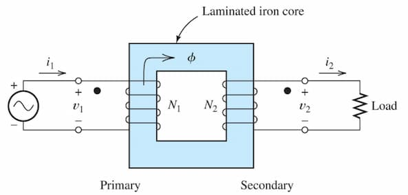

Always the dots in the primary and secondary coils will be opposing.

### Copper loss

The energy dissipated as heat in the windings of the transformer due to the resistance of the copper (or aluminum) conductors.

```math
P_\text{copper} = I^2 R
```

Here:
- $I$ - current flow
- $R$ - resistance of winding

### Leakage flux

The portion of the magnetic flux generated by the transformer windings that does not link with the core or the other winding. This flux escapes into the surrounding air and does not contribute to energy transfer between the primary and secondary windings.

### Ideal Transformer

- No copper losses in the winding
- No leakage flux
- Reluctance of the core ($\mathcal{R}$) is 0
- No core losses

## Equations
```math
V_{2_\text{rms}} = \frac{N_2}{N_1} V_{1_\text{rms}}
```

As $i_1$ and $i_2$ are opposing:

```math
\mathfrak{f} = N_1i_1 - N_2i_2 = \mathcal{R}\phi
```

As $\mathcal{R}=0$: $ $

```math
I_{2_\text{rms}} = \frac{N_1}{N_2} I_{1_\text{rms}}
```

## Impedance Transformation

```math
\frac{Z_2}{Z_1} = \left(\frac{N_2}{N_1}\right)^2
```

Here:
- $Z_1$ - impedance of the primary coil
- $Z_2$ - impedance of the load in the secondary coil

The above transformation is used to convert a transformer into a single circuit for analysis.

## Power

```math
p_2(t) = p_1(t)
```

## Core losses

### Eddy current

Loops of electric current induced within conductors. Current flows in closed loop within a plane. Occurs because of a changing magnetic field in the conductor as described by Faraday's law. Causes significant energy losses as heat.

To reduce eddy currents:
- Laminated cores: Use thin, insulated layers of magnetic material stacked together to restrict the flow of eddy currents.
- High-resistivity materials: Use materials with higher electrical resistance to reduce the magnitude of the currents.

### Hysteresis

The lag between the changes in the magnetic flux density ($B$) and the magnetizing force ($H$) in a magnetic material. Occurs because the magnetic domains within the material do not align instantaneously with the applied magnetic field. As a result, when the magnetic field is cycled, the $B$-$H$ curve forms a loop, known as the hysteresis loop.

The area of the hysteresis loop represents the energy lost as heat in the core material during each cycle of magnetization and demagnetization. This loss is known as hysteresis loss.

To reduce hysteresis losses:
- Use materials with narrow hysteresis loops, such as silicon steel or other soft magnetic materials.
- Optimize the operating frequency to minimize the energy dissipated in the core.
