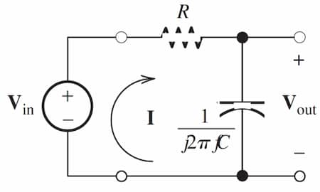
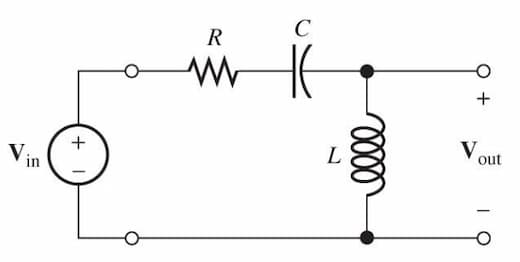

In electronic circuits, filters are components or systems designed to attenuate (reduce) certain frequencies while allowing others to pass through. They process signals based on their frequency content, making them essential for applications like audio systems, radio communications, power supplies, and signal processing.

### Transfer Function

Describes a function's frequency response. Shows how the filter modifies the amplitude and phase of different frequencies. Typically represented as a ratio of the output voltage to the input voltage in the frequency domain.

```math
H(f) = \frac{V_{out}}{V_{in}}
```

A transfer function's magnitude value can be converted to decibels using the formula:

```math
H(f)_{dB} = 20 \log_{10} \lvert H(f) \rvert
```

### Bode plot

A plot of the decibel magnitude of a network function vs. logarithmic frequency.

## Types

### Low Pass Filters

Allows signals with lower frequencies than a certain cutoff frequency ($f_c$) to pass through, while attenuating higher frequencies. $ $

In an ideal low pass filter:

- Frequencies below $f_c$ pass with no attenuation (gain = $1$ or $0$ dB)
- Frequencies above $f_c$ are completely blocked (gain = $0$ or $-\infty$ dB)
- The transition between pass band and stop band occurs instantaneously at $f_c$

Low pass filters are commonly used in audio systems to remove high-frequency noise, anti-aliasing before analog-to-digital conversion, and smoothing in power supplies.

### High Pass Filters

Allows signals with higher frequencies than the cutoff frequency to pass through while attenuating lower frequencies.

In an ideal high pass filter:

- Frequencies above $f_c$ pass with no attenuation
- Frequencies below $f_c$ are completely blocked
- The transition is instantaneous at $f_c$

High pass filters are used to block DC components, reduce low-frequency noise, and in audio applications to isolate higher frequencies.

### Band Pass Filters

Combines the characteristics of both low pass and high pass filters. It allows signals within a specific frequency range (band) to pass through while attenuating frequencies outside this range.

In an ideal band pass filter:

- Frequencies between a lower cutoff frequency ($f_L$) and higher cutoff frequency ($f_H$) pass without attenuation
- Frequencies below $f_L$ and above $f_H$ are completely blocked
- The transitions at both cutoff frequencies are instantaneous

Band pass filters are used in radio receivers to select specific channels, in audio systems to isolate certain frequency ranges, and in many communication systems.

### Optical bandpass filters

Bandpass filters that work on frequencies of light. Used in optical systems to isolate specific wavelengths or colors of light.

Typically consist of multiple layers of dielectric materials with precisely controlled thicknesses. The interference effects between reflections at the boundaries of these layers create the desired transmission characteristics.

- Center wavelength: The wavelength at which maximum transmission occurs
- Bandwidth: The range of wavelengths that can pass through (often specified as Full Width at Half Maximum or FWHM)
- Transmission efficiency: The percentage of light at the peak wavelength that passes through
- Blocking level: How effectively the filter rejects unwanted wavelengths

Optical bandpass filters are essential in spectroscopy, fluorescence microscopy, astronomy, photography, laser systems, and many other optical applications.

### Band-reject filters

Aka. notch filters. Attenuates signals within a specific frequency range while allowing frequencies outside that range to pass through. Opposite function of bandpass filters.

In an ideal band-reject filter:

- Frequencies below a lower cutoff frequency ($f_L$) and above a higher cutoff frequency ($f_H$) pass without attenuation
- Frequencies between $f_L$ and $f_H$ are completely blocked
- The transitions at both cutoff frequencies are instantaneous

Commonly used to eliminate specific interference frequencies, such as removing 50/60 Hz power line noise from audio or measurement systems, suppressing unwanted carriers in communication systems, or eliminating resonances in acoustic applications.

The width of the rejected band can be narrow (as in notch filters targeting a specific frequency) or wide (rejecting a broader range of frequencies).

## Order

### First-order

Contains resistors and one type of reactive component.

| Combination         | Output taken across | Type      |
| ------------------- | ------------------- | --------- |
| Resistor, Capacitor | Capacitor           | Low pass  |
| Resistor, Capacitor | Resistor            | High pass |
| Resistor, Inductor  | Inductor            | High pass |
| Resistor, Inductor  | Resistor            | Low pass  |

$f_B$ is the frequency at which the power of the signal is reduced by half, and called "half power frequency". $ $

```math
f_B = \frac{1}{2\pi R C}\;\; \text{or}\;\; f_B = \frac{R}{2\pi L}
```

#### First-order low-pass filter



```math
H(f) = \frac{1}{1 + j(f/f_B)}
```

When $f=f_B$, the magnitude response is $-3\,\text{dB}$ or $0.707$ of the maximum amplitude. And the phase response is $-45^\circ$.

#### First-order high-pass filter

```math
H(f) = \frac{1}{1 - j(f_B/f)}
```

### Second-order



Contains resistors, capacitors, and inductors. Provides a roll-off rate of $40\,\text{dB}$ per decade (or $12\,\text{dB}$ per octave) beyond the cutoff frequency, making them more effective at signal rejection than first-order filters.

```math
Q = \frac{2\pi f_0 L}{R} = \frac{1}{2\pi f_0 C R}
```

Here $f_0$ is the resonance frequency. Higher $Q$ means higher selectivity, and narrower bandwidth.

| Filter Type | Output Taken Across              | Q Factor              |
| ----------- | -------------------------------- | --------------------- |
| Low Pass    | Capacitor                        | $Q = 1$ (typically)   |
| High Pass   | Inductor                         | $Q = 1$ (typically)   |
| Band Pass   | Resistor                         | Depends on band width |
| Band Reject | Capacitor & inductor (in series) | Depends on band width |
